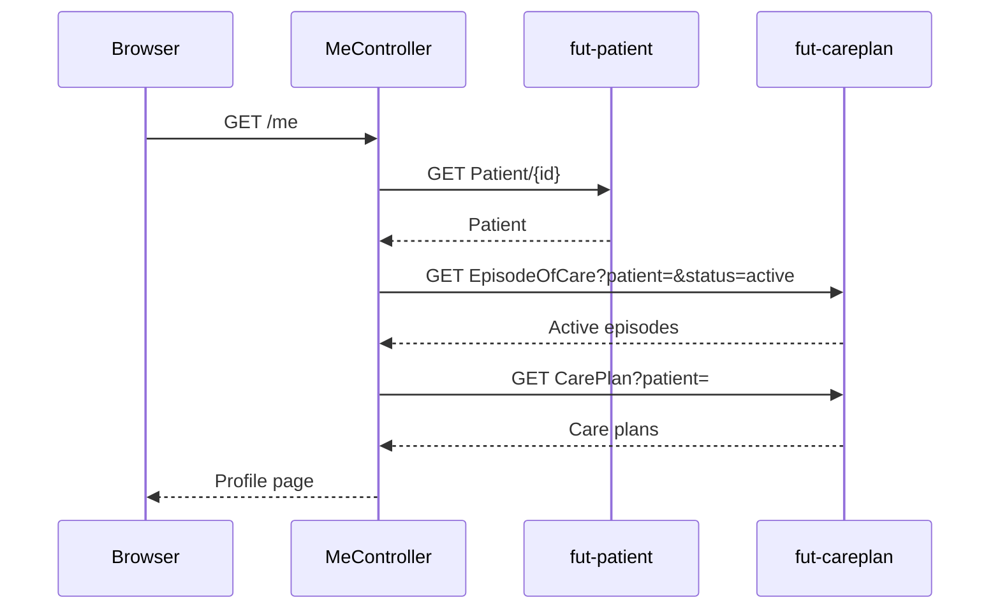

# Citizen profile

The `/me` page shows the logged-in citizen's own Patient record (name, CPR, birth date, gender, address) plus their active episodes of care and care plans.

## User flow

- Authenticated citizen clicks "My profile" in the top nav.
- The app reads the citizen's own Patient resource and their active EpisodeOfCare resources and CarePlans.
- The page displays demographic data and an overview of active episodes and plans.

## Sequence

## Key files

- `citizen-client/src/main/java/.../citizen/controller/MeController.java`: `GET /me`; calls `readSelf`, `listMyActiveEpisodes`, and `findMyCarePlans`; projects the `Patient` through `CitizenView`
- `citizen-client/src/main/java/.../citizen/fhir/CitizenPatientAPI.java`: `readSelf(context)` reads `Patient/{id}` on `FhirServer.PATIENT` using the patient id from `EHealthContext`
- `citizen-client/src/main/java/.../citizen/fhir/CitizenEpisodeOfCareAPI.java`: `listMyActiveEpisodes(context)` searches `EpisodeOfCare?patient=&status=active` on `FhirServer.CARE_PLAN`
- `citizen-client/src/main/java/.../citizen/fhir/CitizenCarePlanAPI.java`: `findMyCarePlans(context)` searches `CarePlan?patient=` on `FhirServer.CARE_PLAN`
- `citizen-client/src/main/java/.../citizen/config/spring/CitizenEHealthContextArgumentResolver.java`: injects `EHealthContext` with `patientId` from the OIDC `user_id` claim
- `citizen-client/src/main/resources/templates/me.html`: demographic card, episode list, care-plan list

## FHIR operations

- `GET Patient/{id}` on `FhirServer.PATIENT`: reads the citizen's own Patient record
- `GET EpisodeOfCare?patient=&status=active` on `FhirServer.CARE_PLAN`: lists active episodes
- `GET CarePlan?patient=&_count=50` on `FhirServer.CARE_PLAN`: lists the citizen's care plans

## Notes

- The patient id in `EHealthContext.patientId()` is always a full URL, for example `https://patient.fut.trifork.com/fhir/Patient/1966248`. `CitizenPatientAPI.readSelf` passes it to HAPI with `withId(new IdType(...))`, so it isn't prefixed twice.
- `CitizenEHealthContextArgumentResolver` passes the `user_id` claim through unchanged when it's already a full URL. If a realm instead sends a bare id, it falls back to `IdFactory.createId(...)`.
- CPR is read from the `Patient.identifier` list, matching the identifier whose system is `urn:oid:1.2.208.176.1.2`.
