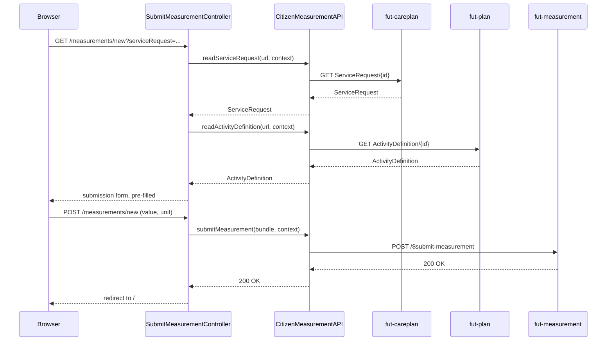

# Submit a measurement

A citizen can submit a reading (e.g. weight, blood pressure) for a scheduled activity from the
weekly view, or for an unscheduled activity from the "Without time" section on the home page.

## User flow

- Citizen clicks "Submit" (scheduled) or "Submit reading" (unscheduled) on an activity card.
- `GET /measurements/new?serviceRequest=...` reads the underlying `ServiceRequest` and its
  `ActivityDefinition` to pre-fill the measurement code and label, and renders the submission form.
- If the resolved code isn't in the `observation-codes` value set (see `ObservationCodes`) - e.g. a
  plain exercise like "do 10 pushups" - the page renders a "Mark done" button instead of the
  value/unit inputs.
- Citizen enters a value (and optional free-text unit) and submits, or clicks "Mark done" for a
  non-measurable activity.
- `POST /measurements/new` builds an `Observation`, wraps it in a transaction `Bundle`, and submits
  it to the measurement server. `POST /measurements/complete` instead reads the `ServiceRequest` and
  PUTs it back with `status=completed`, no Observation involved.
- Citizen is redirected to the home page.

## Key files

- `citizen-client/src/main/java/.../citizen/controller/SubmitMeasurementController.java`: `GET
  /measurements/new` resolves the `ServiceRequest`/`ActivityDefinition` into a form view; `POST
  /measurements/new` builds the `Observation` and submits it; `POST /measurements/complete` marks a
  non-measurable activity done directly
- `citizen-client/src/main/java/.../citizen/fhir/CitizenMeasurementAPI.java`:
  `readServiceRequest(url, context)` (careplan server), `readActivityDefinition(url, context)`
  (plan server), `submitMeasurement(bundle, context)` (measurement server),
  `completeServiceRequest(url, episodeOfCareId, context)` (careplan server, read + PUT)
- `citizen-client/src/main/java/.../citizen/view/SubmitMeasurementFormView.java`: the form-backing
  record (code, patient/episode refs, timing info, the citizen's typed value and unit, and
  `measurable`)
- `citizen-client/src/main/java/.../citizen/models/ObservationCodes.java`: static mirror of the
  `observation-codes` value set, used to decide `measurable`
- `citizen-client/src/main/resources/templates/submit-measurement.html`: the submission form, or a
  "Mark done" button when the activity isn't measurable

## Sequence

## FHIR operations

- `GET ServiceRequest/{id}` on `FhirServer.CARE_PLAN`: reads the activity being measured
- `GET ActivityDefinition/{id}` on `FhirServer.PLAN`: reads the measurement code/label the
  ServiceRequest was instantiated from
- `POST /$submit-measurement` on `FhirServer.MEASUREMENT`: body is `Parameters` wrapping a
  transaction `Bundle` containing one `ehealth-observation`
- `GET ServiceRequest/{id}` + `PUT ServiceRequest/{id}` on `FhirServer.CARE_PLAN` (episode-scoped
  token): the "Mark done" path. `ServiceRequest` has no PATCH operation registered on this server, so
  this reads the resource and PUTs it back with `status=completed`

## Notes

- The `ServiceRequest` is the activity the citizen tapped "submit" on. It's read first because it
  carries what everything else needs: its own id/version (used later by the
  `ehealth-resolved-timing` extension), the `subject` reference put on the `Observation`, the
  episode-of-care extension, and a fallback `code`. It also carries `instantiatesCanonical`, which
  points at the `ActivityDefinition` - that's why the `ActivityDefinition` read only happens once
  the `ServiceRequest` comes back: the client needs it to know what to fetch next.
- `Observation.code` is taken from the `ActivityDefinition` when one was resolved, not from the
  `ServiceRequest`, because the `ActivityDefinition.code` is the one bound to the
  `observation-codes` ValueSet for measurement activities. The `ServiceRequest.code` is used only
  as a fallback when no `ActivityDefinition` reference resolves.
- The `ehealth-resolved-timing` extension links the submission back to the specific slot it
  fulfils, carrying the `ServiceRequest`'s version id at the time `$get-patient-procedures`
  resolved the slot (preferred) or at form-load time (fallback). A `Resolved` timing type requires
  both a start and end; an open-ended slot collapses to a point by reusing the start as the end.
- The citizen types a free-text unit rather than picking a coded UCUM unit. A production client
  would carry a coded `Quantity` (system + code), typically taken from the `ActivityDefinition`;
  the `ehealth-observation` profile permits either.
- A blank or non-numeric value is silently left unset on the `Observation`; the server rejects the
  submission rather than the client validating it client-side.
- `completed` is a terminal `ServiceRequest` status - confirmed against a live environment that a
  PUT moving it back to `active` is rejected. There's no undo once a citizen marks an activity done.
- The "Mark done" write path was verified against a live environment under a **practitioner** token
  (same read-PUT mechanism, same server). It has not yet been exercised under an actual citizen
  (`PATIENT`-type) token - the FUT authorization rules for who may write `ServiceRequest` could differ
  by token type, the way search scoping already does elsewhere in this app. Test it end-to-end via a
  real citizen login before relying on it.
- `ObservationCodes` is a static snapshot of the `observation-codes` value set (IG version
  `2020-03-10T13:13:59`, mirrored from `ValueSet-ehealth-observation-codes.json`). If the platform's
  value set changes, this list goes stale silently - there's no live `$validate-code` call backing it.
