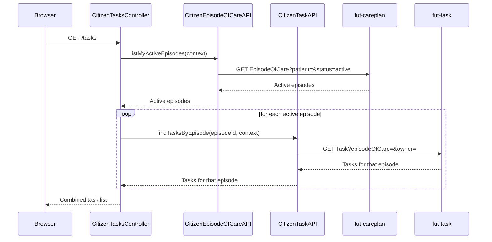

# Task list

Lists tasks assigned to the citizen across their active episodes (e.g. a clinician asking for a
measurement outside the regular schedule, see
[`assign-task.md`](../../clinician-client/docs/assign-task.md) in clinician-client). Each open task
can be marked complete inline.

## User flow

- Citizen clicks "Tasks" to reach `GET /tasks`.
- The page lists tasks across all of the citizen's active episodes of care.
- Each incomplete task has a "Complete" button, posting to mark it done inline without leaving the
  page.

## Sequence

## Key files

- `citizen-client/src/main/java/.../citizen/controller/CitizenTasksController.java`: `GET /tasks` collects
  tasks across all active episodes; `POST /tasks/{id}/complete` marks one done
- `citizen-client/src/main/java/.../citizen/fhir/CitizenTaskAPI.java`:
  `findTasksByEpisode(episodeOfCareId, context)`; `completeTask(taskId, context)` issues a JSON
  Patch `replace /status completed`
- `citizen-client/src/main/java/.../citizen/fhir/CitizenEpisodeOfCareAPI.java`:
  `listMyActiveEpisodes(context)` supplies the episodes to collect tasks across
- `citizen-client/src/main/resources/templates/tasks.html`: task list with inline complete forms

## FHIR operations

- `GET EpisodeOfCare?patient=&status=active` on `FhirServer.CARE_PLAN`: the citizen's active
  episodes, walked across pages
- `GET Task?episodeOfCare=&owner=` on `FhirServer.TASK`: per-episode task list, one call per active
  episode
- `PATCH Task/{id}` on `FhirServer.TASK`: JSON Patch `replace /status completed`

## Notes

- The Task server rejects `Task?patient=` for citizen tokens. `episodeOfCare` must be in both the
  search and the token context, so the app collects tasks one episode at a time instead of
  searching across all episodes at once.
- The search also filters by `owner`, the citizen's own patient reference. So platform assessment
  tasks (`for`=patient, no `owner` set) never show up here, by design. The citizen only sees tasks
  they actually own, exactly the set [`assign-task.md`](../../clinician-client/docs/assign-task.md)
  creates.
