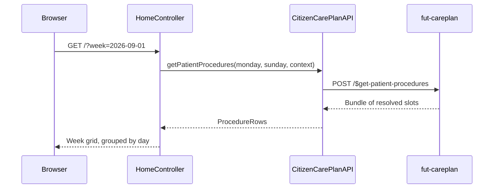

# Weekly activities

The citizen's home page shows a week grid, Monday to Sunday, of their scheduled activities. The careplan server resolves the underlying ServiceRequest timing slots into that grid.

## User flow

- Authenticated citizen lands on `GET /`.
- The app calls `$get-patient-procedures` for the current week (`[Monday, Sunday]`).
- Scheduled rows are grouped by date into seven day columns, sorted by time of day. Rows with no resolved time slot go into a separate "Without time" section instead.
- The citizen can navigate to adjacent weeks via `?week=YYYY-MM-DD`.
- Each activity card shows the activity name, timing type, and a progress indicator (`submitted/requested`).
- Unauthenticated visitors see only the login card.

## Sequence

## Key files

- `citizen-client/src/main/java/.../citizen/controller/HomeController.java`: `GET /`; builds inline citizen context from OIDC `user_id` claim; calls `getPatientProcedures` for `[Monday, Sunday]`; passes `WeekView` to the template
- `citizen-client/src/main/java/.../citizen/fhir/CitizenCarePlanAPI.java`: `getPatientProcedures(startDate, endDate, context)` calls `POST /fhir/$get-patient-procedures` and extracts `ProcedureRow` records from the response `Bundle`
- `citizen-client/src/main/java/.../citizen/models/ProcedureRow.java`: record holding the per-slot fields: CarePlan, ServiceRequest, Activity, ResolvedTimingStart/End, TimingType, OccurrencesRequested, TotalSubmitted
- `citizen-client/src/main/java/.../citizen/mappers/WeeklyActivitiesMapper.java`: buckets `Resolved`/`Extra` rows by date into a `WeekView`; routes `Unresolved`/`Adhoc` rows to the `unscheduled` list
- `citizen-client/src/main/java/.../citizen/view/WeekView.java`: seven `DayView`s plus the `unscheduled` list
- `citizen-client/src/main/resources/templates/home.html`: authenticated and unauthenticated branches; 7-column week grid and "Without time" section
- `citizen-client/src/main/resources/templates/fragments/activity-group.html`: reusable per-day activity card fragment

## FHIR operations

- `POST /fhir/$get-patient-procedures` on `FhirServer.CARE_PLAN`: body is `Parameters` with `patient` (Reference), `start` (DateTimeType, week Monday 00:00), and `end` (DateTimeType, Sunday 23:59:59). Returns a `Bundle`; the first entry is a `Parameters` resource whose top-level parameters are named `item_1`, `item_2`, … each carrying one row as `part` entries.

## Notes

- `$get-patient-procedures` needs a citizen token. Called with a practitioner token, the careplan server returns HTTP 500 "User type not implemented: PRACTITIONER". Only the citizen app reaches this route, since it authenticates via the `nemlogin` realm.
- The server resolves the Timing regimes itself. The client never has to parse Timing structures; it just gets back one `ProcedureRow` per resolved slot.
- `HomeController` builds the `EHealthContext` itself, rather than through `CitizenEHealthContextArgumentResolver`, because this route also serves unauthenticated visitors, and the resolver would throw when there's no login yet.
- On the Trifork environment, the `user_id` OIDC claim is already a full Patient URL. The context builder passes it through unchanged when it starts with `http`, to avoid adding the prefix twice.
