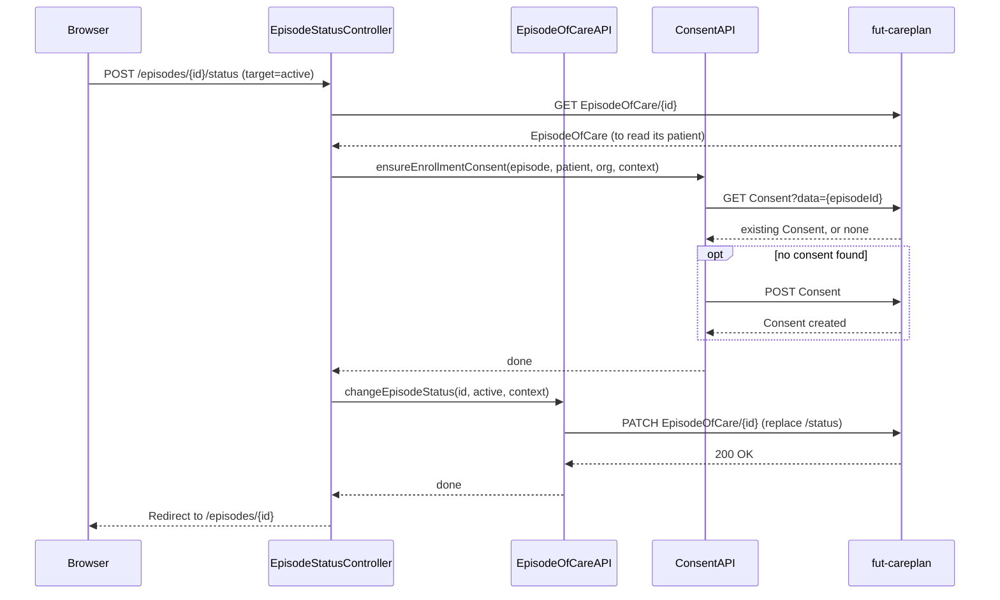

# Activate and close care plans and episodes

A clinician can activate a draft care plan, which flips it and all its activities to active in one step, and can change the status of both care plans and episodes of care through their allowed transitions.

## User flow

**Care plan:**
- On the care-plan detail page, clinician clicks "Activate" when the plan is in `draft` status.
- The plan and all its activities move to active atomically via a transaction bundle.
- A status dropdown on the same page allows further transitions (`active`, `on-hold`, `completed`, `revoked`, `entered-in-error`).

**Episode of care:**
- On the episode detail page, an inline `<select>` lists the valid status transitions (`planned`, `waitlist`, `active`, `onhold`, `finished`, `cancelled`), minus the current status.
- Submitting the form posts to `POST /episodes/{id}/status`.
- Moving to `active` needs one extra step first: the app checks whether a PITEOC enrollment consent exists for the episode, and creates one if it doesn't, before it patches the status.

## Sequence

Moving an episode to `active` is the more involved of the two, since it needs a consent check first:

## Key files

- `clinician-client/src/main/java/.../clinician/app/CarePlansController.java`: `POST /episodes/{eoc}/care-plans/{id}/activate` and `POST /episodes/{eoc}/care-plans/{id}/status`
- `clinician-client/src/main/java/.../clinician/app/EpisodeStatusController.java`: `POST /episodes/{id}/status`; calls `ConsentAPI.ensureEnrollmentConsent` before activating
- `clinician-client/src/main/java/.../clinician/api/CarePlanAPI.java`: `activateCarePlan(id, eoc, context)` (fetch + build transaction + execute); `changeCarePlanStatus(id, eoc, target, context)` (read → mutate status → PUT)
- `clinician-client/src/main/java/.../clinician/api/EpisodeOfCareAPI.java`: `changeEpisodeStatus(id, target, context)` issues a JSON Patch `replace /status`
- `clinician-client/src/main/java/.../clinician/api/ConsentAPI.java`: `ensureEnrollmentConsent(...)` checks for an existing `PITEOC` consent and creates one if absent
- `clinician-client/src/main/java/.../clinician/app/util/CarePlanActivationUtil.java`: `buildActivationBundle(carePlan, serviceRequests)` builds the transaction bundle that flips the plan and each activity to its type-specific active state
- `common/src/main/java/.../common/infrastructure/fhir/JsonPatch.java`: RFC 6902 JSON Patch builder used by `changeEpisodeStatus`
- `clinician-client/src/main/resources/templates/careplan-detail.html`: Activate button (shown when `canActivate`) and status dropdown (shown when `allowedTransitions` is non-empty)
- `clinician-client/src/main/resources/templates/episode-detail.html`: inline episode status form

## FHIR operations

- `POST /CarePlan` transaction on `FhirServer.CARE_PLAN` (episode-scoped token): activation bundle with PUT entries for the CarePlan (`active`) and each activity (Task → `READY`, Appointment → `BOOKED`, ServiceRequest → `ACTIVE`)
- `GET CarePlan/{id}` + `PUT CarePlan/{id}` on `FhirServer.CARE_PLAN`: status change
- `PATCH /EpisodeOfCare/{id}` on `FhirServer.CARE_PLAN` (episode-scoped token): JSON Patch `replace /status`
- `GET Consent?data={episodeId}` + `POST Consent` on `FhirServer.CARE_PLAN`: consent check and creation before episode activation

## Notes

- The careplan server rejects an episode activation with HTTP 422 (`EPISODEOFCARE_PATCH_NO_CONSENT`) unless a `PITEOC` enrollment consent already exists for the episode. `ConsentAPI.ensureEnrollmentConsent` checks first and only creates a consent when none exists, so calling it twice is safe.
- All CarePlan writes, both activate and status change, need the token to carry the owning episode. Both `CarePlansController` methods set that with `context.withEpisodeOfCare(...)` before calling the API.
- The episode PATCH needs the episode in the token context too, or the server returns HTTP 403. `EpisodeOfCareAPI.changeEpisodeStatus` sets it internally with `context.withEpisodeOfCare(id)`.
