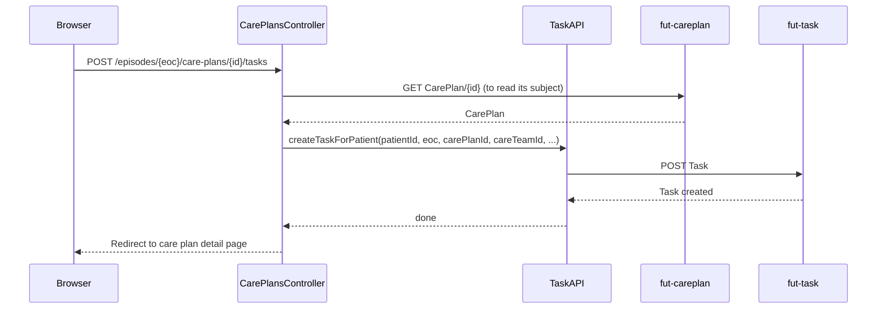

# Assign a task to the citizen

From an active care plan, the clinician can create a task asking the citizen to submit a
measurement. This is a deliberate clinician action, not something the platform does automatically.

## User flow

- On the care plan detail page (`GET /episodes/{eoc}/care-plans/{id}`), clinician clicks "Assign
  task".
- `POST /episodes/{eoc}/care-plans/{id}/tasks` creates a citizen-owned `Task` linked to the care
  plan.
- Clinician is redirected back to the care plan detail page. The new task then shows up on the
  citizen's task list.

## Sequence

## Key files

- `clinician-client/src/main/java/.../clinician/controller/CarePlansController.java`: `POST
  /episodes/{eoc}/care-plans/{id}/tasks` reads the care plan to get its subject (patient), then
  calls `TaskAPI.createTaskForPatient`
- `clinician-client/src/main/java/.../clinician/fhir/TaskAPI.java`:
  `createTaskForPatient(patientId, episodeOfCareId, carePlanId, careTeamId, description, context)`
  builds and creates the `Task`
- `clinician-client/src/main/resources/templates/careplan-detail.html`: the "Assign task" button

## FHIR operations

- `POST Task` on `FhirServer.TASK`: creates a `Task` with `status=requested`, `intent=plan`,
  `for`/`owner` both set to the citizen's Patient reference, and extensions linking it to the
  episode, the care plan, and the responsible CareTeam

## Notes

- The platform's `task-category` codeset has no code that means "please perform a measurement";
  every code is a clinician-facing assessment reason. The client reuses the closest fit,
  `MeasurementForAssessment`, and puts the owning CarePlan's title in `Task.description` instead, so
  a citizen with several concurrent tasks can tell them apart on the task list (falls back to the
  bare CarePlan id when the CarePlan has no title).
- Applying a PlanDefinition (`$apply`) never creates a citizen-owned Task by itself. It only creates
  the CarePlan and its ServiceRequest/Appointment activities. This endpoint exists so a clinician can
  give the citizen something to act on outside that automatic schedule.
- `for` and `owner` are both set to the same Patient reference. That matches what the citizen client
  searches on, see [`tasks.md`](../../citizen-client/docs/tasks.md) in citizen-client.
