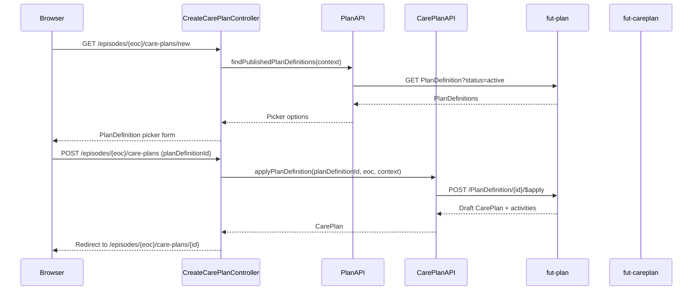

# Care plan detail and create

A clinician picks a published PlanDefinition for an episode and applies it. The server builds a draft CarePlan with its activities from that definition. The detail page shows the plan's status and its Task, Appointment, and ServiceRequest activities.

## User flow

- On the episode detail page, clinician clicks "+ New care plan".
- `GET /episodes/{episodeId}/care-plans/new` lists up to 100 published PlanDefinitions.
- Clinician picks one and submits.
- The app calls `$apply` on the selected PlanDefinition; the server builds a draft CarePlan and its activities.
- Clinician is redirected to `GET /episodes/{episodeId}/care-plans/{id}`.
- The detail page groups activities by type and shows the plan's current status.

## Sequence

## Key files

- `clinician-client/src/main/java/.../clinician/app/CreateCarePlanController.java`: `GET /episodes/{eoc}/care-plans/new` lists PlanDefinitions; `POST /episodes/{eoc}/care-plans` calls `applyPlanDefinition` and redirects
- `clinician-client/src/main/java/.../clinician/app/CarePlansController.java`: `GET /episodes/{eoc}/care-plans/{id}` fetches the plan plus activities and renders the detail view
- `clinician-client/src/main/java/.../clinician/api/PlanAPI.java`: `findPublishedPlanDefinitions(context)` searches `status=active` on `FhirServer.PLAN`, capped at 100
- `clinician-client/src/main/java/.../clinician/api/CarePlanAPI.java`: `applyPlanDefinition(planDefinitionId, episodeOfCareId, context)` calls the instance-level `$apply`; `fetchCarePlanByIdWithActivities(id, eoc, context)` searches with `_include=CarePlan:activity-reference`
- `clinician-client/src/main/java/.../clinician/app/CarePlanMapper.java`: `toDetailView(...)` groups activities by type; `toOptions(...)` builds the PlanDefinition picker list; `extractEpisodeOfCareId(...)` reads the mandatory `workflow-episodeOfCare` extension
- `clinician-client/src/main/resources/templates/create-careplan.html`: PlanDefinition picker form
- `clinician-client/src/main/resources/templates/careplan-detail.html`: detail page with activity tables, Activate button, and status-change dropdown

## FHIR operations

- `GET PlanDefinition?status=active&_count=100` on `FhirServer.PLAN`: PlanDefinition picker list
- `POST /PlanDefinition/{id}/$apply` on `FhirServer.PLAN`: instance-level `$apply` with `Prefer: return=representation`; body is `Parameters` with one `episodeOfCare` reference; returns a `CarePlan` or a `Bundle` containing one
- `GET CarePlan?episodeOfCare=&care-team=&_id=&_include=CarePlan:activity-reference` on `FhirServer.CARE_PLAN`: fetches the plan with its activities

## Notes

- Routes are nested under the episode (`/episodes/{eoc}/care-plans/{id}`). The careplan server denies CarePlan read/write unless the access token carries the owning episode, so the episode id must be in the URL. `CarePlansController` uses it to scope the token with `context.withEpisodeOfCare(...)`.
- A plain `_id` search that leaves out `episodeOfCare` or `care-team` is rejected with HTTP 403 ("Search parameters not matching security token context"). `fetchCarePlanByIdWithActivities` always includes both.
- `$apply` runs on the plan server. The resulting CarePlan is saved on the careplan server, a different server.
- The link from a CarePlan back to its EpisodeOfCare comes from the mandatory `workflow-episodeOfCare` extension, not from `encounter` or `supportingInfo`.
- The plan server holds over 44,000 active PlanDefinitions on the shared Trifork environment. The picker is deliberately capped at one page of 100. A real implementation should filter by topic or publisher instead.
