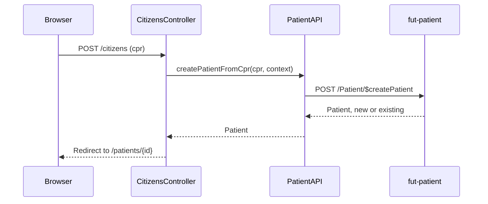

# Create citizen

A clinician enters a CPR number. The server either finds the matching citizen or creates a new one.

## User flow

- Clinician navigates to "Open citizen" (`GET /citizens/new`).
- Clinician enters a 10-digit CPR number and clicks "Open citizen".
- The app calls `$createPatient` on fut-patient.
- Whether the citizen was just created or already existed, the clinician is redirected straight to
  the patient detail page (`/patients/{id}`).
- If the CPR isn't found in the CPR registry, the form re-renders with the message "Citizen not found in the CPR registry".

## Sequence

## Key files

- `clinician-client/src/main/java/.../clinician/controller/CitizensController.java`: `GET /citizens/new` renders the form; `POST /citizens` invokes the operation and redirects to the resulting citizen, or re-renders the form on a not-found
- `clinician-client/src/main/java/.../clinician/fhir/PatientAPI.java`: `createPatientFromCpr(cpr, context)` builds the `Parameters` body and calls `$createPatient`; throws `ResourceNotFoundException` on a CPR miss
- `clinician-client/src/main/resources/templates/citizens/new.html`: single-field CPR form with `pattern="\d{10}"` client-side validation

## FHIR operations

- `POST /fhir/Patient/$createPatient` on `FhirServer.PATIENT`: body is `Parameters` with one `crn` identifier (system `urn:oid:1.2.208.176.1.2`); returns `Parameters` whose first resource is the created/updated `Patient`.

## Notes

- One server call does the look-up, the creation, and the CPR-registry enrichment together. The client never has to work out "brand new" versus "already existed" itself: it just takes the returned `Patient.id` and redirects there.
- The default HAPI socket timeout was raised to 60 s in `FhirConfiguration`. The registry lookup this operation performs can take longer than the default 10 s.
