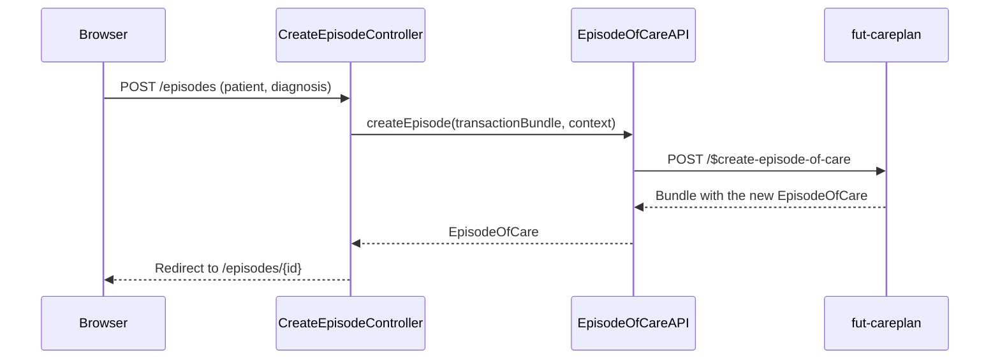

# Create episode of care

A clinician picks a diagnosis and creates a new EpisodeOfCare, with a linked Condition, for a patient. One server call does both.

## User flow

- Clinician is on a patient detail page or the episode list and clicks "+ New episode".
- `GET /episodes/new?patient={patientId}` renders a form with a diagnosis dropdown (five SKS codes).
- Clinician picks a diagnosis and submits.
- The app builds a transaction Bundle and calls `$create-episode-of-care` on the careplan server.
- On success the clinician is redirected to `GET /episodes/{id}` for the new episode.

## Sequence

## Key files

- `clinician-client/src/main/java/.../clinician/controller/CreateEpisodeController.java`: `GET /episodes/new?patient=` renders the form; `POST /episodes` builds a patient-scoped context, calls `createEpisode`, and redirects
- `clinician-client/src/main/java/.../clinician/fhir/EpisodeOfCareAPI.java`: `createEpisode(transactionBundle, context)` wraps the bundle in a `Parameters.episodeOfCareAndProvenances` parameter and calls `POST /$create-episode-of-care`
- `clinician-client/src/main/java/.../clinician/mappers/EpisodeOfCareMapper.java`: `toCreateEpisodeTransaction(patientId, conditionOption, context)` builds the transaction bundle
- `clinician-client/src/main/java/.../clinician/models/ConditionCodeOption.java`: hardcoded list of five SKS codes (DE11, DJ44, DI50, DI25, DG20) from value set `http://ehealth.sundhed.dk/vs/conditions`
- `clinician-client/src/main/resources/templates/create-episode.html`: diagnosis picker form

## FHIR operations

- `POST /$create-episode-of-care` on `FhirServer.CARE_PLAN`: body is `Parameters` with one `episodeOfCareAndProvenances` parameter, whose value is a transaction `Bundle`. The bundle holds a `Condition` POST entry and an `EpisodeOfCare` POST entry, linked by a `urn:uuid:` placeholder. It returns a `Bundle`; the `EpisodeOfCare` is read from it.

## Notes

- The token must carry the patient id in context (`context.withPatient(qualifiedPatientId)`), or the server returns "Security token context missing for user type: Patient".
- The Condition must be a separate transaction entry, not embedded inside the EpisodeOfCare. The IG profile requires this: `diagnosis.condition` must be a real reference, not a contained resource.
- The EpisodeOfCare entry must carry the `ehealth-episodeofcare-caremanagerOrganization` extension; the profile requires it. `EpisodeOfCareMapper.toCreateEpisodeTransaction` sets it from `context.organizationId()`.
- The Condition must carry `clinicalStatus = active` and `verificationStatus = confirmed`. Without both, the server rejects it (FHIR invariant `con-5`).
