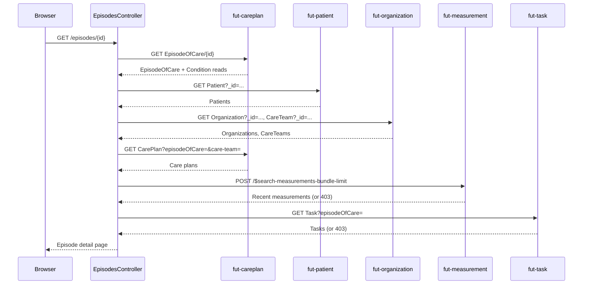

# Episodes of care (list and detail)

Shows the current CareTeam's planned and active episodes of care grouped by patient, and provides a detail view for a single episode: its diagnosis, care team, linked care plans, and a preview of recent measurements and tasks.

## User flow

- Clinician clicks "Episodes" in the top nav to reach `GET /episodes`.
- The page lists up to 100 episodes (capped, since a care team can hold tens of thousands), grouped by patient name.
- Clinician clicks an episode to reach `GET /episodes/{id}`.
- The detail page shows status, diagnosis condition, managing organization, care team, and a patient card.
- It also shows the care plans attached to the episode, a 90-day preview of recent measurements, and a task preview. If the clinician's role can't read measurements or tasks, that section shows an access notice instead of failing the whole page.

## Sequence

The detail page is the more involved of the two; the list page is one bounded search.

## Key files

- `clinician-client/src/main/java/.../clinician/controller/EpisodesController.java`: `GET /episodes` (list) and `GET /episodes/{id}` (detail); resolves Patient, Organization, and CareTeam references via follow-up calls, then adds the measurement and task previews
- `clinician-client/src/main/java/.../clinician/fhir/EpisodeOfCareAPI.java`: `findPlannedAndActiveEpisodesByTeam(context)` (single bounded page, `_include=EpisodeOfCare:condition`); `fetchEpisodeOfCareById(id, context)` (direct read scoped to the episode, with per-id Condition reads)
- `clinician-client/src/main/java/.../clinician/fhir/CarePlanAPI.java`: `findCarePlansByEpisode(episodeId, context)` used on the detail page
- `clinician-client/src/main/java/.../clinician/fhir/MeasurementAPI.java`: `searchMeasurements(...)` supplies the 90-day recent-measurement preview
- `clinician-client/src/main/java/.../clinician/fhir/TaskAPI.java`: `findTasksByEpisode(...)` supplies the task preview
- `clinician-client/src/main/java/.../clinician/mappers/EpisodeOfCareMapper.java`: maps `SearchResult` into `PatientEpisodesView` / `EpisodeOfCareDetailView`
- `clinician-client/src/main/resources/templates/episodes.html`: episode roster grouped by patient
- `clinician-client/src/main/resources/templates/episode-detail.html`: detail page including inline status-change form, care-plan summary list, measurement preview, and task preview

## FHIR operations

- `GET EpisodeOfCare?team=&status=planned,active&_include=EpisodeOfCare:condition&_count=100` on `FhirServer.CARE_PLAN`: list call
- `GET EpisodeOfCare/{id}` on `FhirServer.CARE_PLAN` (token scoped to the episode): detail read; followed by individual `GET Condition/{id}` reads for each diagnosis
- `GET Organization?_id=...` and `GET CareTeam?_id=...`, both on `FhirServer.ORGANIZATION`: follow-up calls to resolve organization and team names (the CapabilityStatement does not list `EpisodeOfCare:team` as a supported `_include`)
- `GET Patient?_id=...` on `FhirServer.PATIENT`: bulk patient lookup
- `GET CarePlan?episodeOfCare=&care-team=` on `FhirServer.CARE_PLAN`: care plans listed on the detail page
- `POST /$search-measurements-bundle-limit` on `FhirServer.MEASUREMENT`: recent-measurement preview, a 90-day lookback
- `GET Task?episodeOfCare=` on `FhirServer.TASK`: task preview

## Notes

- The careplan server only supports `_include=EpisodeOfCare:condition` on EpisodeOfCare searches. Organization and CareTeam names need separate follow-up calls, both against the organization server, not the careplan server.
- A plain read of an EpisodeOfCare, or an `?_id=` search, is rejected with HTTP 403 unless the access token carries that episode's id in its context. `fetchEpisodeOfCareById` scopes the token with `context.withEpisodeOfCare(...)` before the read.
- The list page is capped at 100 episodes. The app never walks the full team set, because the server-side `_getpages` cursor can expire partway through on large teams.
- The measurement and task previews each degrade separately on a 403: a clinician whose role can't read measurements still sees the rest of the page, just with an access notice in that one section.
