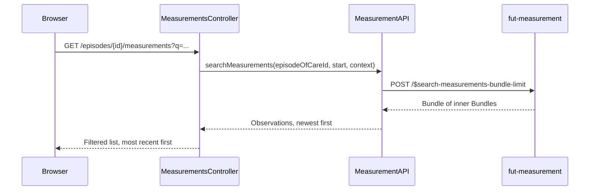

# Measurement list

Full measurement history for one episode of care, with a free-text search across date, measurement
name, and value. The episode detail page shows a recent preview; this page lists everything.

## User flow

- From the episode detail page, clinician clicks through to `GET /episodes/{id}/measurements`.
- The page lists every measurement submitted for the episode (up to the operation's bundle limit),
  most recent first.
- Clinician can filter the list with a free-text query (`?q=...`), matched case-insensitively
  against date, measurement name, and value.

## Sequence

## Key files

- `clinician-client/src/main/java/.../clinician/app/MeasurementsController.java`: `GET
  /episodes/{id}/measurements` fetches and filters the list
- `clinician-client/src/main/java/.../clinician/api/MeasurementAPI.java`:
  `searchMeasurements(episodeOfCareId, start, context)` calls `$search-measurements-bundle-limit`
- `clinician-client/src/main/java/.../clinician/app/MeasurementView.java`: flattens the outer/inner
  bundle structure into one row per `Observation`, sorted newest first; `matches(query)` implements
  the free-text filter
- `clinician-client/src/main/resources/templates/measurements.html`: the list page with the search
  box

## FHIR operations

- `POST /$search-measurements-bundle-limit` on `FhirServer.MEASUREMENT`: body is `Parameters` with
  `episodeOfCare`, `start` (a ten-year lookback, effectively "all history"), and `count=100`.
  Returns an outer `Bundle` whose entries are inner Bundles, one per `$submit-measurement`
  invocation

## Notes

- Each inner Bundle can hold more than one resource type from the original submission (`Media`,
  `QuestionnaireResponse`, `Provenance`, and more). `MeasurementView` only reads the `Observation`s
  out of it.
- A multi-component observation, such as blood pressure, renders as one row with a
  slash-separated value, not one row per component.
- The free-text search happens client-side, after the bounded fetch. It narrows what's shown on
  screen; it doesn't reduce what the server sends.
