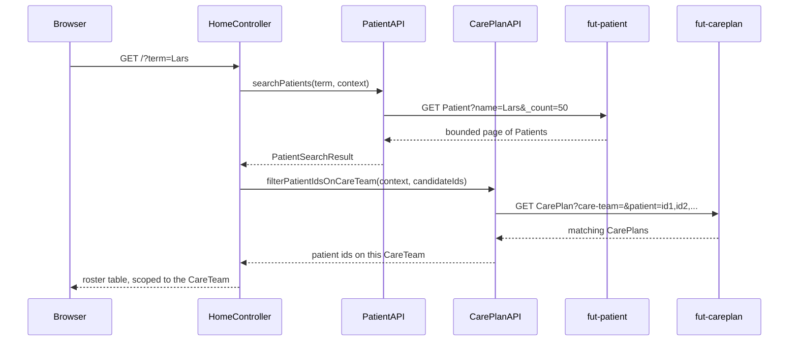

# Search citizens

The home page roster only shows patients with a care plan updated in the last 30 days. Typing a
name or CPR into the search box instead queries fut-patient directly, then narrows the matches down
to the clinician's own CareTeam.

## User flow

- Clinician types into the search box on the home page and submits (`GET /?term=...`).
- No term: unchanged 30-day roster.
- A term present: the app searches fut-patient for it, then keeps only the matches that also have a
  care plan on the clinician's CareTeam.
- Results render in the same table as the roster. A "there may be more, refine your search" note
  appears when the search hit the 50-result cap.
- There is no "all citizens" mode. fut-patient only lets a practitioner token search within its own
  CareTeam, no matter how the search is written.

## Key files

- `clinician-client/src/main/java/.../clinician/controller/HomeController.java`: `GET /` branches on
  whether `term` is present; `searchRows(...)` runs the search-then-narrow sequence below
- `clinician-client/src/main/java/.../clinician/fhir/PatientAPI.java`:
  `searchPatients(term, context)` - a 10-digit term matches CPR exactly via the
  `patientCPRIdentifier` search parameter, anything else matches `Patient.NAME` as a prefix match
  (`.matches()`, not `.contains()`); returns a `PatientSearchResult` capped at 50 with a `truncated`
  flag
- `clinician-client/src/main/java/.../clinician/fhir/CarePlanAPI.java`:
  `filterPatientIdsOnCareTeam(context, candidatePatientIds)` - one bounded `CarePlan` search
  combining `care-team` and `patient` (any of the candidate ids), used to keep only the citizens
  actually on the clinician's team
- `clinician-client/src/main/resources/templates/home.html`: the search form and the shared
  patient-table partial

## FHIR operations

- `GET Patient?patientCPRIdentifier=<cpr>` or `GET Patient?name=<term>&_count=50` on
  `FhirServer.PATIENT`: the citizen search itself, one bounded page, no `_getpages` walk
- `GET CarePlan?care-team=<id>&patient=<id1>,<id2>,...&_count=50` on `FhirServer.CARE_PLAN`: narrows
  the search hits down to the clinician's own team

## Sequence

## Notes

- `Patient.NAME.matches()` (a left-anchored/prefix match, e.g. "Lars" finds "Larsen") is used
  instead of `:contains`. The `:contains` modifier was tried first and returned HTTP 503 ("Filter
  operation took too long") against the shared Trifork-internal test catalogue: an unanchored scan
  can't use a normal index at this data volume, while a prefix match can.
- The search-then-narrow sequence is two separate calls because `CarePlan` carries no patient name
  to filter on directly, only a patient reference. There's no way to search fut-careplan by name in
  one round-trip.
- `filterPatientIdsOnCareTeam` does the narrowing: given the candidate patient ids from the
  fut-patient search, it queries fut-careplan for `CarePlan?care-team=<id>&patient=<id1>,<id2>,...`
  and returns only the ids that come back. That's how a citizen who exists in fut-patient but has no
  care plan on this CareTeam gets dropped from the results.
- Both calls are single bounded pages (50 candidates in, 50 CarePlan matches out), so this never
  risks a `_getpages` cursor expiring mid-walk the way an unbounded team-wide traversal would.
