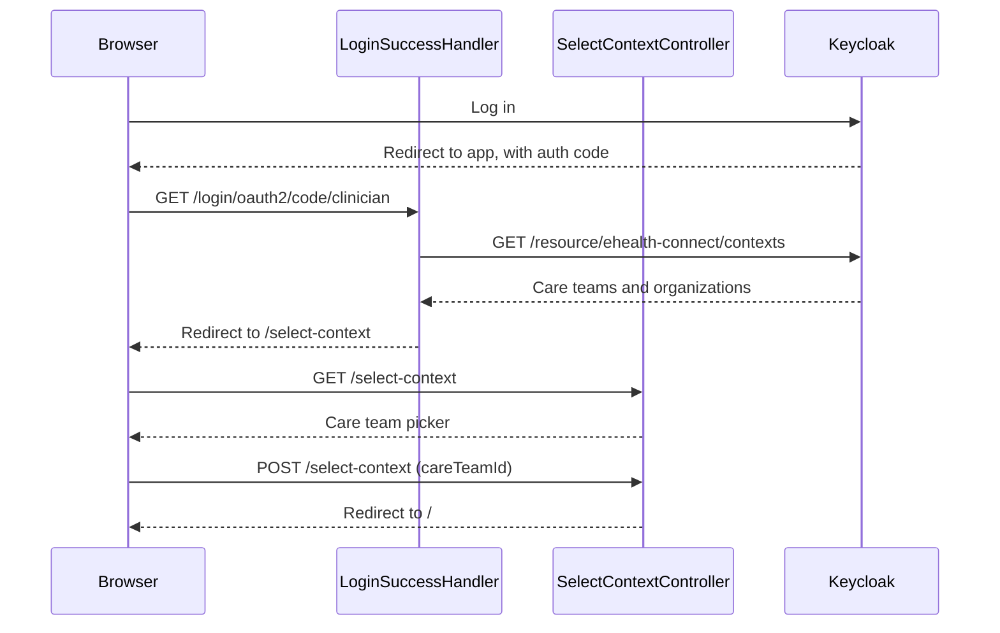

# CareTeam context selection

After login, the clinician picks which CareTeam to act as. Every FHIR call after that carries the team's id and its organization's id in the access token.

## User flow

- Clinician logs in via OAuth2 (Keycloak `ehealth` realm).
- `LoginSuccessHandler` calls `GET ${issuer}/resource/ehealth-connect/contexts` and stores the returned care-team list on the HTTP session.
- The clinician is redirected to `/select-context` and picks one team from the list.
- The chosen `CareTeamOption` is stored in session; `SelectedContextInterceptor` enforces that every protected route redirects here if no selection exists.

## Sequence

## Key files

- `clinician-client/src/main/java/.../clinician/controller/SelectContextController.java`: `GET /select-context` renders the picker; `POST /select-context` writes `selected-context` to session
- `clinician-client/src/main/java/.../clinician/security/LoginSuccessHandler.java`: fetches available care teams on login success and stores them as `availableContexts`
- `clinician-client/src/main/java/.../clinician/config/spring/EHealthContextArgumentResolver.java`: builds `EHealthContext` from the session-stored `CareTeamOption` for every controller method
- `clinician-client/src/main/java/.../clinician/config/spring/SelectedContextInterceptor.java`: redirects unauthenticated or no-selection requests to `/select-context`
- `common/src/main/java/.../common/web/EHealthContextOptionsClient.java`: Spring HTTP interface that calls the Keycloak SPI endpoint
- `clinician-client/src/main/resources/templates/select-context.html`: radio-button list of CareTeams

## FHIR operations

- `GET ${ehealth.issuer-uri}/resource/ehealth-connect/contexts`: Keycloak SPI (not a FHIR call); returns `{ care_teams: [...], organizations: [...] }`. Auth: bearer token from the clinician realm.

## Notes

- The contexts endpoint is a Keycloak extension, not a FHIR resource. It lives at the Keycloak issuer URL, not a FHIR server URL.
- If the clinician has no CareTeam at all, the app redirects through `/logout` instead of showing an empty picker.
- Writing an `EpisodeOfCare` needs a special tag on the OAuth2 client. fut-careplan checks for this tag. The pre-provisioned reference clients already have it.
