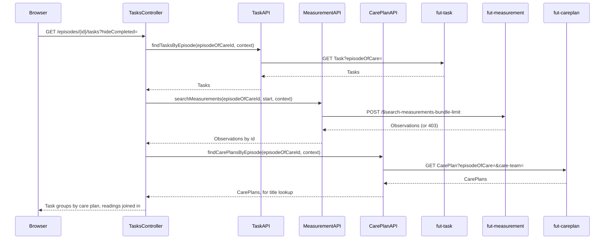

# Task list and status update

The clinician's view of tasks linked to one episode of care, grouped by the care plan each task is
about and joined to the measurement each task is about so a reviewer sees the reading inline. The
platform creates these Tasks automatically when a citizen submits a measurement (see the Notes
section below); the client never creates one itself.

## User flow

- From the episode detail page, clinician clicks through to `GET /episodes/{id}/tasks`.
- The page groups tasks under one card per care plan, headed by the care plan's title linking to its
  detail page. A submission can create several tasks at once (see Notes), so grouping keeps them from
  reading as unrelated entries. When a task's `focus` points at an `Observation`, the resolved reading
  is shown inline.
- A "Hide completed" / "Show completed" link toggles whether `completed` tasks are shown, via a
  `?hideCompleted=true` query parameter - not client-side state, so it survives the redirect after a
  status change.
- Clinician changes a task's status (e.g. approve or reject a reading) via a status form on each
  row; `POST /episodes/{id}/tasks/{taskId}/status` applies it and redirects back to the list,
  carrying the current `patient` and `hideCompleted` state through so neither resets.

## Sequence

## Key files

- `clinician-client/src/main/java/.../clinician/controller/TasksController.java`: `GET
  /episodes/{id}/tasks` lists tasks, joins them to measurements and care plan titles, and groups
  them; `POST /episodes/{id}/tasks/{taskId}/status` changes a task's status
- `clinician-client/src/main/java/.../clinician/fhir/TaskAPI.java`:
  `findTasksByEpisode(episodeOfCareId, context)`; `changeTaskStatus(taskId, target, context)` issues
  a JSON Patch `replace /status`
- `clinician-client/src/main/java/.../clinician/fhir/CarePlanAPI.java`:
  `findCarePlansByEpisode(episodeOfCareId, context)`, reused here to resolve each group's title
- `clinician-client/src/main/java/.../clinician/view/TaskView.java`: one row per task, resolving
  `Task.focus` to the matching `MeasurementView` when the focus is an `Observation`, and
  `carePlanId` from the `ehealth-reference-careplan` extension every platform-created Task carries
- `clinician-client/src/main/java/.../clinician/view/TaskGroupView.java`: groups `TaskView`s by
  `carePlanId`, resolving each group's `carePlanTitle` from a bare-id-to-title map
- `clinician-client/src/main/resources/templates/tasks.html`: the grouped task list, the
  hide/show-completed link, and inline status forms

## FHIR operations

- `GET Task?episodeOfCare=&_count=200` on `FhirServer.TASK`: the episode's tasks
- `POST /$search-measurements-bundle-limit` on `FhirServer.MEASUREMENT`: a ten-year lookback used
  only to resolve each task's focus `Observation` to a displayable reading (see
  [`measurements.md`](measurements.md) for the same operation on its own list page)
- `GET CarePlan?episodeOfCare=&care-team=` on `FhirServer.CARE_PLAN`: the episode's care plans, for
  each group's title (same call `episodes.md`'s care-plan summaries use)
- `PATCH Task/{id}` on `FhirServer.TASK`: JSON Patch `replace /status`

## Notes

- This is how a clinician acknowledges a measurement submission: the measurement server creates a
  Task for each submission, and this page is where the clinician lists and processes them.
- One `$submit-measurement` call can create more than one Task, all carrying the same
  `ehealth-reference-careplan` extension.
  Grouping by `carePlanId` is what keeps a multi-task submission from reading as unrelated rows.
- Resolving a task's focus measurement can fail with a 403 when the caller's role can't read
  measurements. The page catches that and shows "no inline reading" for that one task instead of
  failing the whole page.
- This page is a good example of how an aggregate view costs round trips: rendering one task list
  touches three FHIR servers in three separate calls (`fut-task` for the tasks themselves,
  `fut-measurement` for the readings they're about, `fut-careplan` for the care plan titles to group
  by) before a single row can be drawn. None of the three servers can answer "give me this episode's
  tasks, joined to their readings and care plan titles" in one request - each only knows about its
  own resource type. Composing a page like this always means the client fans out to every server one
  of its fields depends on, then joins the results itself; there's no cross-server `_include`.
