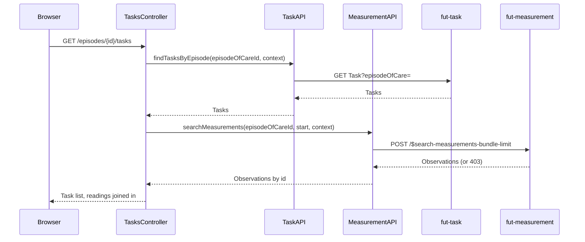

# Task list and status update

The clinician's view of tasks linked to one episode of care, joined to the measurement each task is
about so a reviewer sees the reading inline. Distinct from
[`assign-task.md`](assign-task.md), which is how a task gets created in the first place.

## User flow

- From the episode detail page, clinician clicks through to `GET /episodes/{id}/tasks`.
- The page lists every task linked to the episode. When a task's `focus` points at an `Observation`,
  the resolved reading is shown inline.
- Clinician changes a task's status (e.g. approve or reject a reading) via a status form on each
  row; `POST /episodes/{id}/tasks/{taskId}/status` applies it and redirects back to the list.

## Sequence

## Key files

- `clinician-client/src/main/java/.../clinician/app/TasksController.java`: `GET
  /episodes/{id}/tasks` lists tasks and joins them to measurements; `POST
  /episodes/{id}/tasks/{taskId}/status` changes a task's status
- `clinician-client/src/main/java/.../clinician/api/TaskAPI.java`:
  `findTasksByEpisode(episodeOfCareId, context)`; `changeTaskStatus(taskId, target, context)` issues
  a JSON Patch `replace /status`
- `clinician-client/src/main/java/.../clinician/app/TaskView.java`: one row per task, resolving
  `Task.focus` to the matching `MeasurementView` when the focus is an `Observation`
- `clinician-client/src/main/resources/templates/tasks.html`: the task list with inline status forms

## FHIR operations

- `GET Task?episodeOfCare=&_count=200` on `FhirServer.TASK`: the episode's tasks
- `POST /$search-measurements-bundle-limit` on `FhirServer.MEASUREMENT`: a ten-year lookback used
  only to resolve each task's focus `Observation` to a displayable reading (see
  [`measurements.md`](measurements.md) for the same operation on its own list page)
- `PATCH Task/{id}` on `FhirServer.TASK`: JSON Patch `replace /status`

## Notes

- This is how a clinician acknowledges a measurement submission: the measurement server creates a
  Task for each submission, and this page is where the clinician lists and processes them. Creating
  a task the other way, to ask the citizen for something, is a separate action, see
  [`assign-task.md`](assign-task.md).
- Resolving a task's focus measurement can fail with a 403 when the caller's role can't read
  measurements. The page catches that and shows "no inline reading" for that one task instead of
  failing the whole page.
