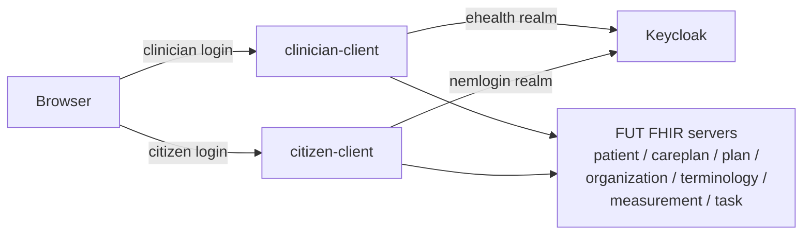

# Architecture

This document is a short tour for first-time readers.

## Two independent web applications

The repository contains two Spring Boot 3.4 web applications:

- **clinician-client** is used by healthcare professionals. It authenticates against the FUT
  Keycloak `ehealth` realm and lets a clinician select a CareTeam profile, search for or create
  citizens, and manage episodes of care, care plans, and tasks.
- **citizen-client** is used by patients. It authenticates against the FUT Keycloak `nemlogin`
  realm (NemLogin) and shows a citizen their planned weekly activities, task list, and own profile.

Each app is its own deployment unit, with its own `Dockerfile` and `application.yaml`. They share
no runtime state, and neither app calls the other's API.

- On a tagged release, `.github/workflows/docker.yml` builds and pushes both images to
  `ghcr.io/fut-infrastructure/{clinician-client,citizen-client}`.
- `deploy/docker-compose.yml` runs both apps locally.
- There is no Helm chart or Kubernetes manifest in this repository.

The split between the two apps matches a real security boundary: a clinician's token carries
CareTeam and organization context, a citizen's token carries only their own identity.

## Where this runs

`devenvcgi` is the default environment, baked into `deploy/docker-compose.yml` with pre-provisioned
OAuth2 clients, so a first run needs no configuration. The same setup targets any other registered
FUT non-production environment by supplying a different `.env` (see
[`connect-to-test.md`](onboarding/connect-to-test.md)). Both apps are otherwise environment-agnostic:
nothing in the code names a specific environment.

## System context

One diagram, not an attempt to show every FHIR operation; see each feature doc under
`clinician-client/docs/` and `citizen-client/docs/` for the operations a specific screen calls.

## Shared common module

Both apps depend on a single `common` Maven module. It holds three kinds of shared code:

1. **FHIR client helpers**: `FhirClientFactory`, `FhirServer` enum, `BaseUrlResolver`,
   `IdFactory`, `BundleUtil`, `SearchUtil`. Every outbound FHIR call goes through
   `FhirClientFactory.createClient(server, context)`. It attaches the right bearer token and
   base URL before the call goes out.
2. **OAuth2 refresh extension**: `EHealthRefreshTokenGrantRequest`,
   `EHealthRefreshTokenResponseClient`, and the request-scoped `EHealthUser` bean. FUT's Keycloak
   accepts extra parameters on the `refresh_token` grant. Those parameters scope the new access
   token to one organization, CareTeam, patient, and episode of care. Spring Security doesn't
   support this by default, so this extension adds the extra form parameters to the refresh
   request.
3. **Calm CSS**: a hand-written `calm.css` with six component patterns used across all templates
   (`chip`, `card`, `data-row`, `button`, `form`, `layout`).

## Authentication and security context

Both apps use Spring Security OAuth2, but against different Keycloak realms: clinicians log in
through the `ehealth` realm, citizens through the `nemlogin` realm.

FUT's FHIR APIs need more than just who the user is. Every access token must also carry an
organization, a CareTeam, a patient, and an episode of care. The apps hold that information in
one record, `EHealthContext`, and pass it to every outbound FHIR call. A controller never reads
session state or token claims itself; the context arrives as a typed method parameter instead.

See [`authentication.md`](authentication.md) for the full login flow, how a context turns into a
scoped bearer token on each FHIR call, and how session expiry is handled.

## FHIR layering

Each module's `fhir/` package wraps raw FHIR calls, with one rule: keep FHIR calls and clinical
logic apart. Each class there is one FHIR-facing concern: a search, a read, a create, a custom
operation, or FHIR-adjacent infrastructure (client factory, bundle helpers). No business logic
and no convenience composition lives here. A reader should be able to scan this layer in one
sitting and see "FHIR, plus auth" and nothing more.

Business logic, such as finding the top parent of an organization hierarchy, grouping activities
by week, or mapping a FHIR `EpisodeOfCare` into a display record, lives in `mappers/` and
`controller/` instead, calling the raw `fhir/` classes and transforming the results into `view/`
records.

This split is deliberate. A vendor reading the code should find it easy to locate where FHIR
calls happen, and just as easy to find where the clinical logic happens, without the two being
tangled together.

