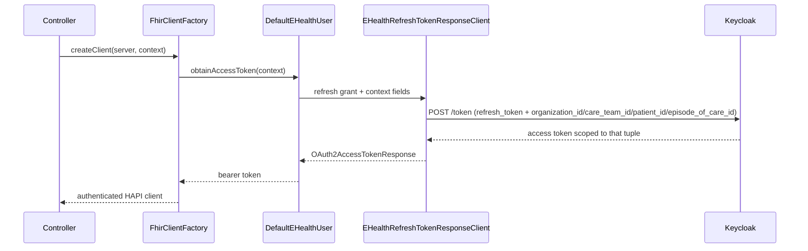

# Login, security, and tokens

How both apps authenticate, how a FHIR request gets its bearer token, and why the token changes
shape between requests.

## Login

Both apps use Spring Security's OAuth2 authorization-code login against a FUT Keycloak realm. The
key difference is client type:

- **clinician-client** is a confidential client (has a client secret) in the `ehealth` realm.
  After login, `LoginSuccessHandler` fetches the clinician's available CareTeams before letting the
  request continue, and redirects to `/select-context` first so a CareTeam gets picked before any
  protected route is reached (see [`select-context.md`](../clinician-client/docs/select-context.md)).
- **citizen-client** is a public client, no client secret, in the `nemlogin` realm. It uses PKCE
  instead (set as `client-authentication-method: none` via an environment variable in
  `deploy/docker-compose.yml`). `CitizenEHealthContextArgumentResolver` reads the patient id from
  the OIDC `user_id` claim on every request.

Both apps allow anonymous access to only a few routes: `/`, static assets, `/actuator/**`, the
OAuth2 endpoints, and `/error`. Every other route needs an authenticated session
(`SecurityConfiguration` in each app's `security/` package).

## Why the token needs to change shape

FUT's FHIR APIs authorize requests against a scope tuple carried in the access token, not just the
user's identity:

- organization
- CareTeam
- patient
- episode of care.

A clinician's first login token carries none of that. Keycloak doesn't know which CareTeam the
clinician wants until they pick one. And the tuple can change between requests, for example when
a clinician switches to a different patient or episode.

Logging in again for every scope change would be a bad experience, so FUT's Keycloak accepts four
extra form parameters on a `refresh_token` grant. It uses them to issue a new access token scoped
to whatever tuple was supplied.

`EHealthContext` (`common/.../security/EHealthContext.java`) holds that four-field tuple:
`organizationId`, `careTeamId`, `patientId`, `episodeOfCareId`, each a full FHIR URL. Every
FHIR-calling method in the codebase takes one as a parameter. Right before a call, that context is
sometimes narrowed further with `.withPatient(...)` or `.withEpisodeOfCare(...)`, because a
specific operation often needs a tighter scope than the ambient one. A citizen search, for
example, scopes to just the candidate patient ids; an episode read scopes to that one episode.

## From context to bearer token

- `FhirClientFactory.createClient(server, context)` (`common/.../fhir/FhirClientFactory.java`) is
  the one entry point every `*API` class uses. It resolves the target base URL, asks
  `DefaultEHealthUser` for a token scoped to `context`, and puts that token on a fresh HAPI client
  as a Bearer header.
- `DefaultEHealthUser.obtainAccessToken(context)` (`common/.../security/DefaultEHealthUser.java`,
  request-scoped) loads the session's `OAuth2AuthorizedClient`, sends `context` through an
  `EHealthRefreshTokenGrantRequest` via `EHealthRefreshTokenResponseClient`, and saves the
  refreshed client back to the session. If there's no refresh token to work with, it just returns
  the existing access token unchanged, since a refresh isn't possible.
- `EHealthRefreshTokenResponseClient` (`common/.../security/EHealthRefreshTokenResponseClient.java`)
  wraps Spring Security's own `RestClientRefreshTokenTokenResponseClient`. It adds
  `organization_id`, `care_team_id`, `patient_id`, `episode_of_care_id` as extra form parameters,
  each one only when it's set.
- This runs on **every** FHIR call, not just once per session. A token scoped to yesterday's
  episode isn't valid for today's, so each `createClient` call re-scopes the token fresh.

## CareTeam selection (clinician only)

- `LoginSuccessHandler` calls `GET ${issuer}/resource/ehealth-connect/contexts` right after login,
  and stores the returned `List<CareTeamOption>` on the session. If that call fails, the app
  invalidates the session and sends the user back to `/`, rather than leaving them half logged in.
- `SelectContextController` (`GET`/`POST /select-context`) lets the clinician pick one. It stores
  the choice under `SelectContextController.SELECTED_CONTEXT_ATTRIBUTE`.
- `SelectedContextInterceptor` sends any protected route to `/select-context` when there's no
  selection yet. That way, a controller that asks for an `EHealthContext` never has to check for
  one itself.
- `EHealthContextArgumentResolver` reads the selected `CareTeamOption` off the session and turns it
  into an `EHealthContext`, using `CareTeamOption.toEHealthContext()`, for every controller method
  that asks for one. That includes the care team id and its affiliation's organization id.

The citizen app skips all of this. `CitizenEHealthContextArgumentResolver` builds the context
straight from the OIDC `user_id` claim on each request; there's no session-stored selection
involved.

## Session expiry

Both apps keep session state in memory rather than a shared store: the OAuth2 authorized client,
and for clinician-client, the selected CareTeam too. Restarting an app wipes all of it, but a
browser can still present a valid `JSESSIONID` cookie for a session the server no longer knows
about.

- `StaleAuthenticationException` (`common/.../exceptions/StaleAuthenticationException.java`) is
  thrown whenever that gap shows up: no authorized client found
  (`DefaultEHealthUser.obtainAccessToken`), no CareTeam selected
  (`EHealthContextArgumentResolver`), or a missing or invalid OIDC token
  (`CitizenEHealthContextArgumentResolver`).
- `ReAuthenticationAdvice` (`common/.../config/spring/ReAuthenticationAdvice.java`) catches that exception,
  along with Spring Security's own `ClientAuthorizationRequiredException` and
  `OAuth2AuthorizationException`. It shows a plain "your session expired" page
  (`error/session-expired.html`) instead of silently redirecting into Spring Security's default
  logout confirmation page, which would otherwise leave the user confused about what happened.
  Logging back in from that page works normally.

## Logout

Both apps wire `OidcClientInitiatedLogoutSuccessHandler` so `POST /logout` ends the Keycloak session
too, not just the local one, redirecting back to the app's own base URL afterward.
