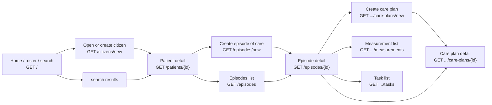
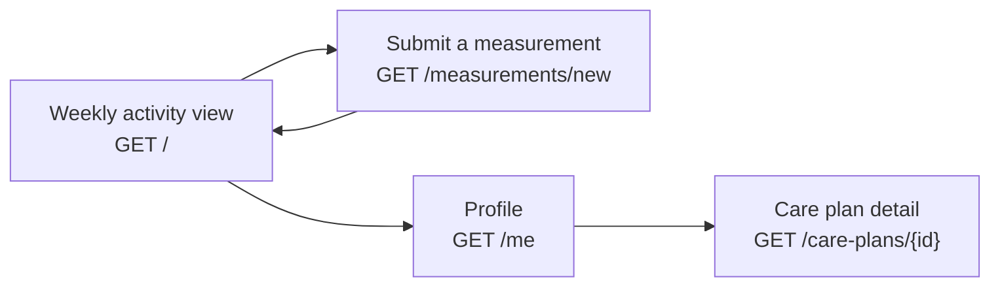

# User guide

A screen-by-screen reading aid for navigating both apps. This isn't a replacement for the feature
docs under `clinician-client/docs/` and `citizen-client/docs/`, it's a map of how the screens
connect; each entry links to the feature doc that covers it in detail where one exists.

## clinician-client

| Screen                 | Route                                 | Feature doc                                                       |
|------------------------|---------------------------------------|-------------------------------------------------------------------|
| Home / roster / search | `GET /`                               | [search-citizens.md](../clinician-client/docs/search-citizens.md) |
| CareTeam picker        | `GET /select-context`                 | [select-context.md](../clinician-client/docs/select-context.md)   |
| Open or create citizen | `GET /citizens/new`                   | [create-citizen.md](../clinician-client/docs/create-citizen.md)   |
| Patient detail         | `GET /patients/{id}`                  | -                                                                 |
| Episodes list          | `GET /episodes`                       | [episodes.md](../clinician-client/docs/episodes.md)               |
| Episode detail         | `GET /episodes/{id}`                  | [episodes.md](../clinician-client/docs/episodes.md)               |
| Create episode of care | `GET /episodes/new?patient={id}`      | [create-episode.md](../clinician-client/docs/create-episode.md)   |
| Create care plan       | `GET /episodes/{eoc}/care-plans/new`  | [care-plans.md](../clinician-client/docs/care-plans.md)           |
| Care plan detail       | `GET /episodes/{eoc}/care-plans/{id}` | [care-plans.md](../clinician-client/docs/care-plans.md)           |
| Measurement list       | `GET /episodes/{id}/measurements`     | [measurements.md](../clinician-client/docs/measurements.md)       |
| Task list              | `GET /episodes/{id}/tasks`            | [tasks.md](../clinician-client/docs/tasks.md)                     |

## citizen-client

| Screen               | Route                   | Feature doc                                                           |
|----------------------|-------------------------|-----------------------------------------------------------------------|
| Weekly activity view | `GET /`                 | [weekly-activities.md](../citizen-client/docs/weekly-activities.md)   |
| Profile              | `GET /me`               | [profile.md](../citizen-client/docs/profile.md)                       |
| Care plan detail     | `GET /care-plans/{id}`  | -                                                                     |
| Submit a measurement | `GET /measurements/new` | [submit-measurement.md](../citizen-client/docs/submit-measurement.md) |

